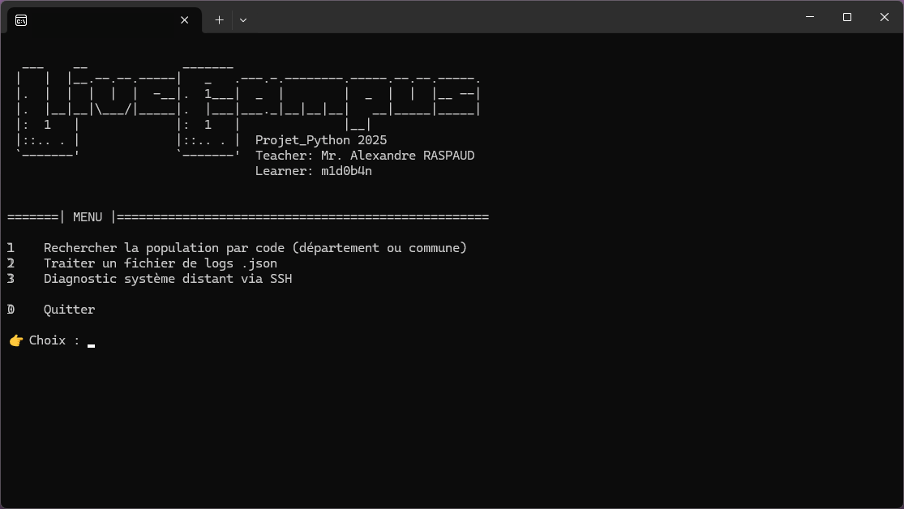

# 🐍 Projet Python 2025 🐍
# Diagnostic | Géolocalisation | Analyse de Logs


Ce projet Python interactif propose un menu terminal intuitif avec plusieurs outils intégrés. Il s’adresse à toute personne souhaitant :
- Obtenir des informations géographiques via une API publique
- Analyser un fichier de logs JSON
- Effectuer un diagnostic système distant via SSH

   

## 📦 Version Windows (.exe)
Une version exécutable est disponible directement pour Windows dans l'onglet [Releases](../../releases) du dépôt.

😎 **Aucune installation de Python n'est requise !**

---

## 📋 Fonctionnalités disponibles

### 1️⃣ Rechercher la population par code
- Interroge l’API publique `https://geo.api.gouv.fr/communes`
- Entrée : un code département (2 chiffres) ou un code postal (5 chiffres)
- Affiche :
  - La population de la zone
  - Un lien vers une carte sur [code-postal.com](https://www.code-postal.com/)

### 2️⃣ Traiter un fichier de logs JSON
- Lecture d’un fichier JSON local
- Analyse des logs `error` et `warning`
- Résumé en console : nombre d’erreurs et avertissements
- Export possible vers un fichier `.xlsx` :
  - Colonnes : `Nom de la station`, `Niveau de l'erreur`, `Message de l'erreur`

### 3️⃣ Diagnostic système distant (via SSH)
- Connexion à une machine distante avec Fabric
- Récupération des informations suivantes :
  - OS
  - CPU (modèle, architecture, cœurs…)
  - RAM totale
  - 5 processus les plus gourmands en RAM
  - Variables d’environnement (PATH, HOME, USER…)
  - Partitions de disque
  - Espace disque disponible
  - Interfaces réseau
  - Heure du dernier démarrage
- Export Excel (.xlsx) possible, avec mise en page automatisée :
  - Cellules alignées en haut/gauche, renvoi à la ligne automatique
  - Onglet nommé : `System status`

---

## 🧱 Structure du projet

```bash
.
├── main.py                     # Menu interactif principal
├── modules/                   # Modules principaux
│   ├── ascii_art.py           # Affichage ASCII d'accueil
│   ├── geo_api.py             # Requête API géographique
│   ├── log_analyzer.py        # Analyse des logs JSON
│   └── system_diag.py         # Diagnostic système via SSH
├── utils/
│   ├── validators.py          # Fonctions de validation (chemins, fichiers…)
│   └── exporter.py            # Gestion factorisée des exports Excel
├── data/                      # Données d'entrée
│   ├── logs.json              # Exemple de logs fournis
│   └── ...                    # Autres fichiers de travail
├── extracts_examples/         # Fichiers Excel générés ou exemples d'exports
│   └── *.xlsx                 # Exports de logs ou diagnostics
├── requirements.txt           # Dépendances Python
└── README.md
```

---

## 🚀 Installation manuelle (mode développeur)

🔧 **Pré-requis :** Avoir [Python 3.10+](https://www.python.org/downloads/) installé sur votre machine.

1. Cloner le repo ou télécharger le zip :
```bash
git clone https://github.com/m1d0b4n/Projet_Python.git && cd Projet_Python
```

2. Installer les dépendances :
```bash
pip install -r requirements.txt
```

3. Lancer le projet :
```bash
python main.py
```

---

## 🛠️ Compiler en .exe (pour Windows)

🔧 **Pré-requis :** Avoir [Python installé](https://www.python.org/downloads/) et `pip` disponible.

1. Cloner le repo ou télécharger le zip :
```bash
git clone https://github.com/m1d0b4n/Projet_Python.git && cd Projet_Python
```

2. Installer PyInstaller :
```bash
pip install pyinstaller
```

3. Compiler le projet :
```bash
pyinstaller --name "ProjetPython2025" --onefile main.py
```

➡️ Un fichier `ProjetPython2025.exe` apparaîtra dans le dossier `dist/`

💡 Pour ajouter une icône personnalisée :
```bash
pyinstaller --name "ProjetPython2025" --onefile main.py --icon=<./chemin_vers_icon.ico>
```

---

## 📦 Dépendances

Liste issue de `requirements.txt` :
- `requests`
- `pandas`
- `openpyxl`
- `fabric`

---

## 🧠 Auteur

Projet réalisé dans le cadre du module Python 2025  
👨‍💻 **Apprenant :** `m1d0b4n`  
👨‍🏫 **Enseignant :** Alexandre RASPAUD

---

## 🖼️ Screenshots



---
